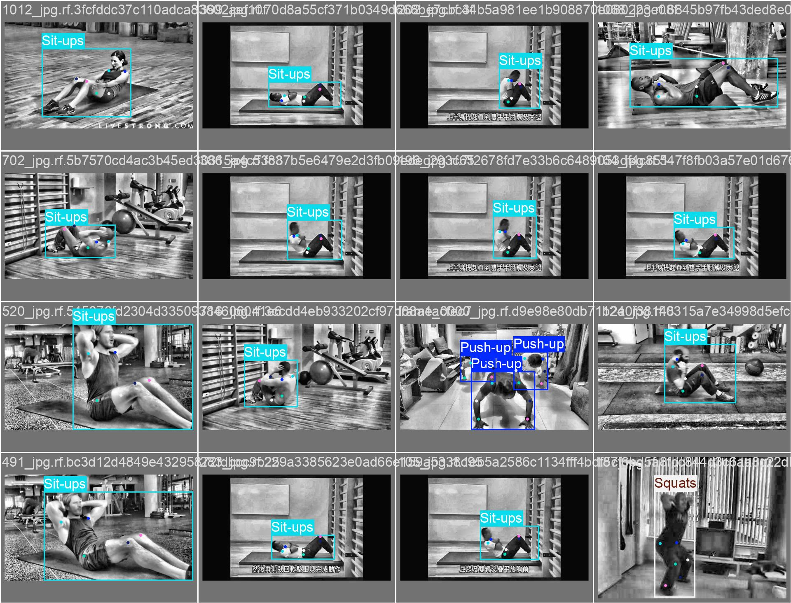
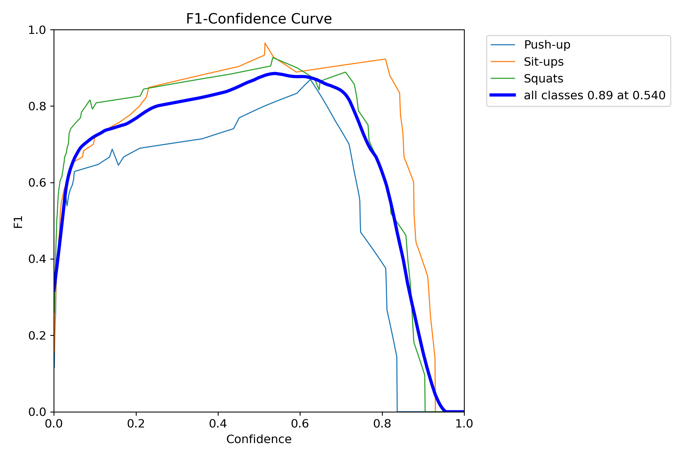
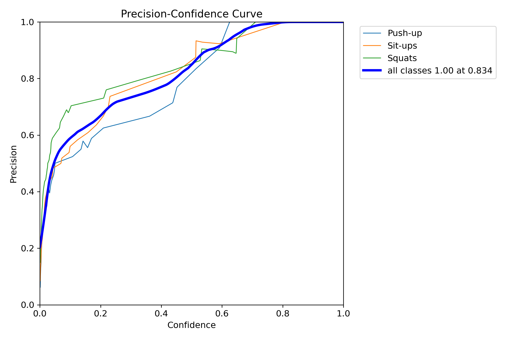
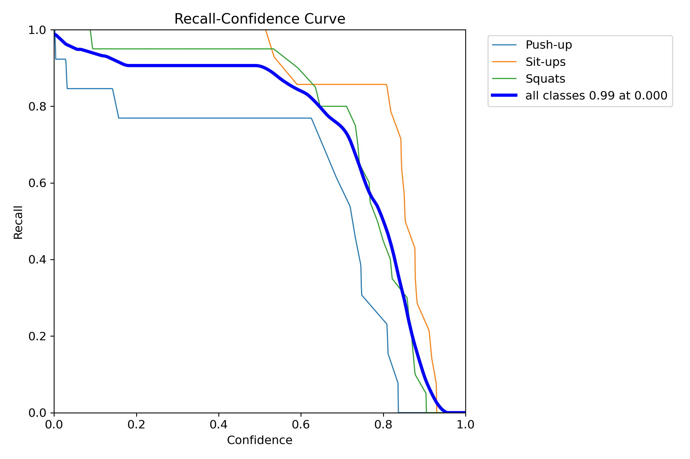
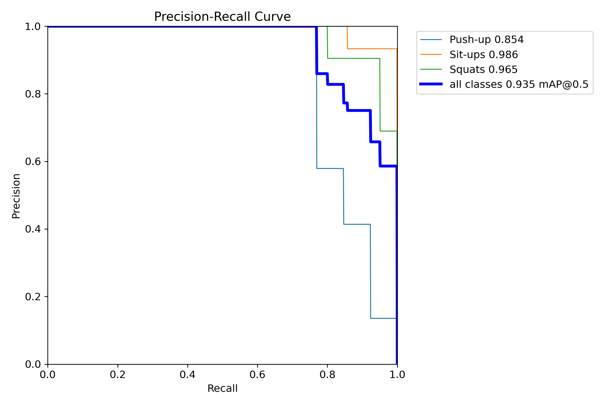
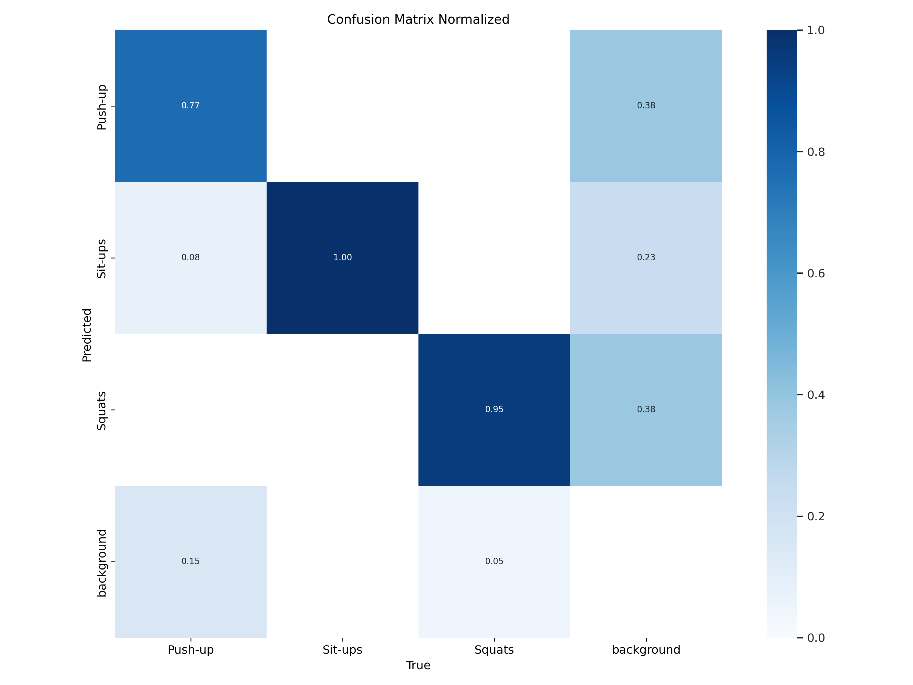
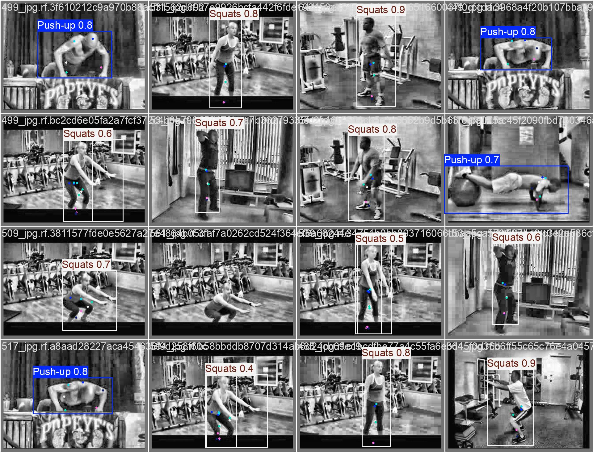
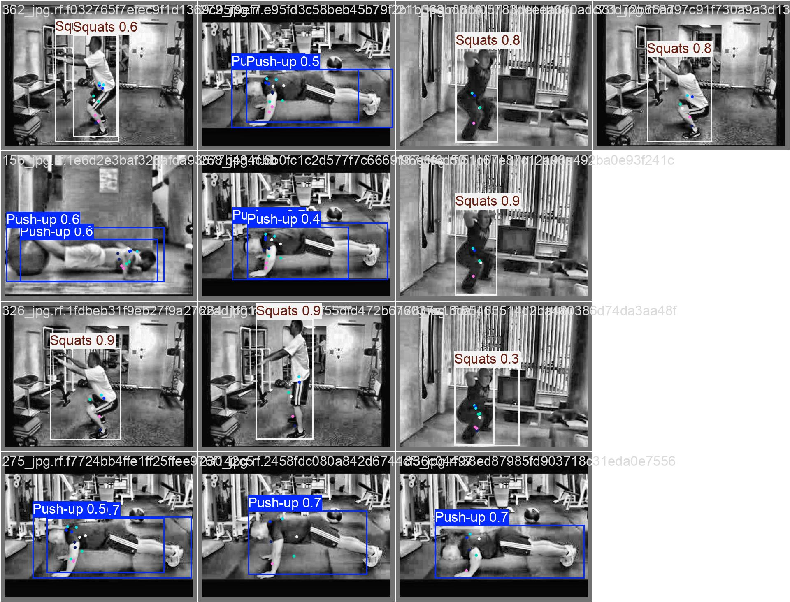

# Pose Estimation using YOLO11



A PyTorch-based implementation of a pose estimation model leveraging the YOLOv11 architecture. This project processes human pose data from COCO-style datasets and applies a fine-tuned detection model to predict keypoints with evaluation metrics like MPJPE, OKS, and PCK.

---

## 📌 Features

- YOLOv11 backbone for fast and efficient keypoint detection
- COCO keypoint dataset loading & augmentation
- Extensive evaluation metrics (MPJPE, OKS, PCK, etc.)
- Augmented training loop with validation tracking
- Torch `Dataset`, `DataLoader` pipeline
- Model checkpointing on best validation loss

---

## 🖼️ Demo Samples

<h3>Training Curve Visualizations</h3>

<table>
  
  <tr>
    <td></td>
    <td></td>
  </tr>
  
  <tr>
    <td></td>
    <td></td>
  </tr>
  
</table>

<td></td>

<h3>Model Predictions</h3>

<table>
  <tr>
    <td></td>
    <td></td>
  </tr>
</table>

---

## 📁 Dataset Format

This project uses a COCO-style dataset with the following directory structure:

```
.
├── assets/              # Static assets like images or label maps
├── data/                # Dataset-related code (loading, preprocessing, etc.)
├── models/              # Model architecture definitions
├── utils/               # Utility functions and helper modules
├── config.py            # Configuration file (hyperparameters, paths, etc.)
├── main.py              # Entry point for inference or pipeline orchestration
├── train.py             # Training script
├── vitnew.ipynb         # Experimental notebook (possibly ViT-related)
├── yolo11n.pt           # Pretrained YOLOv5n model weights
└── README.md            # Project documentation (you're reading it!)

```

Each `json` file must follow COCO format, especially with `images` and `annotations` entries.

---

## 🔧 Setup & Installation

```bash
git clone https://github.com/yourusername/yolopose.git
cd yolopose
pip install -r requirements.txt
```

**Required Libraries:**

- `torch`, `torchvision`, `transformers`
- `Pillow`, `numpy`, `matplotlib`

You can install them with:

```bash
pip install torch torchvision transformers pillow numpy matplotlib
```

---

## 🚀 Training

Update the dataset paths in the script:

```python
train_dataset = PoseDataset(
    image_root='path/to/train/images',
    json_path='path/to/train/_annotations.coco.json',
    transform=transform
)
```

Then simply run:

```bash
python yolopose_train.py
```

---

## 📈 Evaluation Metrics

- **MPJPE** (Mean Per Joint Position Error)
- **PCK** (Percentage of Correct Keypoints)
- **OKS** (Object Keypoint Similarity)
- **NME** (Normalized Mean Error)
- **KDA** (Keypoint Detection Accuracy)
- **AP/AR** (Average Precision/Recall)

Example training log:

```
Epoch [5/20], Train Loss: 0.002341, Val Loss: 0.001832, MPJPE: 0.023, PCK: 92.5, OKS: 0.89, ...
🔥 New best model saved with val_loss 0.001832
```

---

## 💾 Model Checkpointing

Best model will be saved to:

```
best_model.pth
```

You can load it later with:

```python
model.load_state_dict(torch.load("best_model.pth"))
model.eval()
```

---

## 📌 TODOs

- [ ] Add real-time inference module
- [ ] Export to ONNX for deployment
- [ ] Add KVA metric support

---

## 🤝 Contributing

Pull requests and feature suggestions are welcome!

---

## 📜 License

[MIT License](LICENSE)

---

## 📬 Contact

For questions or collaborations: [your-email@example.com](mailto:your-email@example.com)
